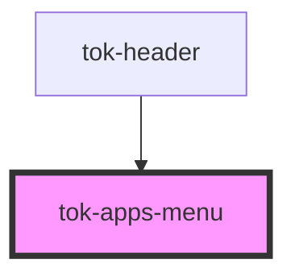

# tok-apps-menu

<!-- Auto Generated Below -->

## Properties

| Property | Attribute | Description | Type    | Default     |
| -------- | --------- | ----------- | ------- | ----------- |
| `apps`   | --        |             | `App[]` | `undefined` |

## Events

| Event   | Description | Type                |
| ------- | ----------- | ------------------- |
| `close` |             | `CustomEvent<void>` |

## Dependencies

### Used by

 - [tok-header](../header)

### Graph

----------------------------------------------

*Built with [StencilJS](https://stenciljs.com/)*
