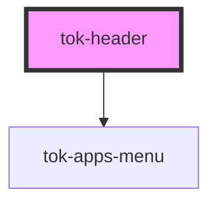

# my-component

<!-- Auto Generated Below -->

## Properties

| Property    | Attribute    | Description | Type      | Default                      |
| ----------- | ------------ | ----------- | --------- | ---------------------------- |
| `apps`      | --           |             | `App[]`   | `undefined`                  |
| `logoHref`  | `logo-href`  |             | `string`  | `'https://www.tokenizer.cc'` |
| `pageTitle` | `page-title` |             | `string`  | `undefined`                  |
| `sideMenu`  | `side-menu`  |             | `boolean` | `false`                      |

## Events

| Event          | Description | Type                   |
| -------------- | ----------- | ---------------------- |
| `sideMenuOpen` |             | `CustomEvent<boolean>` |

## Dependencies

### Depends on

- [tok-apps-menu](../apps-menu)

### Graph

----------------------------------------------

*Built with [StencilJS](https://stenciljs.com/)*
